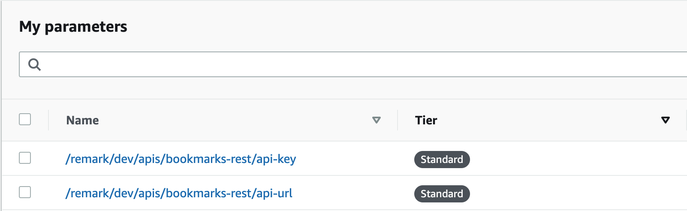

<p align="center" dir="auto">
  
</p>
<p align="center" dir="auto">
  <a href="/LICENSE" >
    
  </a>
  
</p>

---

Open-source AWS based backend for Remark, AI-powered <b>`bookmark manager`</b> for web.

## Why?

Instead of relying on side services that take control over your data let's use the one of the biggest in the industry. So there is left to care only about costs for using the lambdas, the moment of which will happen not in the near future with the Free Tier provided by AWS.

## How?

First of all you need to prepare the place for unfolding the backend. You need an AWS account to have access to [AWS console](https://console.aws.amazon.com/iam/home#/security_credentials).

1. Click <b>`"Access keys (access key ID and secret access key)"`</b> tab and create Id and Key
2. Create or update <b>`~/.aws/config`</b> and <b>`~/.aws/credentials`</b> on your machine to setup remark profile with secrets which you got on the first step.

```bash
# ~/.aws/config

[remark]
region = us-west-1 # or whatever you prefer
output = json
```

```bash
# ~/.aws/credentials

[remark]
aws_access_key_id=YOUR_ID
aws_secret_access_key=YOUR_KEY
```

3. Then you need to deploy this backend to your AWS account. The commnd below will download this package, find configured profile and upload it to found AWS account.

```bash
npx -p @vtcaregorodtcev/remark-aws-backend -c "npm run deploy"
```

4. After deploy you can check your [api services](https://console.aws.amazon.com/apigateway/main/apis) under your AWS account and test endpoints.
5. If you want to use preconfigured profiles or other regions you can extend above command.

```bash
npx -p @vtcaregorodtcev/remark-aws-backend -c "PROFILE=local REGION=us-west-2 npm run deploy"
```

6. Go to [SSM Parametrs store](https://console.aws.amazon.com/systems-manager/parameters) to get needed info about your api. It will be needed by Remark chrome extension.



## Ecosystem

| Project                                                                       | Status                                                       | Description                                                                               |
| ----------------------------------------------------------------------------- | ------------------------------------------------------------ | ----------------------------------------------------------------------------------------- |
| [remark-extension](https://github.com/vtcaregorodtcev/remark-extension)       |  | The main client. Chrome web-extension. |
| [remark-telegram-bot](https://github.com/vtcaregorodtcev/remark-telegram-bot) |  | Mobile client of Remark based on telegram messanger. Have the same functionality.         |
